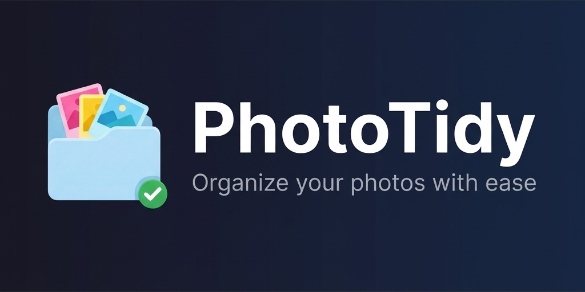

# PhotoTidy



A modern photo organization tool for sorting, grouping, and managing your photo library.


## Features

### 📁 Smart Photo Organization
- **Date Sorting** - Group photos by year, month, or day
- **Location Sorting** - Automatic GPS-based grouping with reverse geocoding
- **Camera Sorting** - Organize by camera make/model
- **Manual Location Tagging** - Tag photos without GPS data
- **Configurable Location Format** - Choose suburb, city, or full address display

### 🎨 Multiple View Modes
- **Thumbnails** - Large preview icons
- **Tiles** - Medium icons with metadata
- **List** - Compact rows
- **Details** - Table view with columns

### 🛠️ Photo Management
- **Batch Rename** - Custom patterns (date, location, sequence)
- **Move/Copy** - Organize into folders with undo support
- **Rotate** - Lossless EXIF-based rotation
- **Delete** - Move to Recycle Bin (can be restored)
- **Preview** - Full-size preview with metadata panel

### 🖼️ Image Processing (v1.2.0)
- **⚡ Batch Processing** - Chain multiple operations: Resize → Rotate → Rename → Watermark → WebP
- **Mass Resize** - Resize by percentage, max dimension, or exact size
- **Text Watermark** - Custom text with system fonts, color, and opacity
- **Image Watermark** - Use any image as a watermark (logos, signatures)
- **WebP Conversion** - Convert to WebP for optimized web uploads
- Output saved to subfolders (`Batch Processed/`, `Resized/`, `Watermarked/`, `WebP/`)

### 📷 Format Support
- **Standard**: JPG, PNG, GIF, BMP, TIFF, WebP
- **RAW**: CR2, CR3, NEF, ARW, DNG, RAF, ORF, RW2
- **HEIC/HEIF**: iPhone photos

## Installation

### Requirements
- Python 3.10 or higher
- Windows 10/11 (primary), Linux/macOS (experimental)

### Quick Start

```bash
# Clone the repository
git clone https://github.com/xersbtt/PhotoTidy.git
cd PhotoTidy

# Install dependencies
pip install -r requirements.txt

# Run the application
python main.py
```

## Usage

### Opening Photos
- Click **📁 File** menu to open folder, files, or add folders
- **Drag & drop** files or folders onto the window

### Keyboard Shortcuts

| Shortcut | Action |
|----------|--------|
| `Ctrl+O` | Open folder |
| `Ctrl+A` | Select all |
| `Ctrl+D` | Deselect all |
| `Ctrl+Z` | Undo |
| `Ctrl+1/2/3/4` | Switch view mode |
| `F2` | Rename selected |
| `F5` | Refresh |
| `F1` | About |
| `Ctrl+,` | Settings |

### Right-Click Menu
Right-click any photo for quick actions:
- Open File / Show in Explorer
- Select/Deselect
- Rename / Set Location
- Remove from View
- Delete (Recycle Bin)

## Project Structure

```
PhotoTidy/
├── main.py                  # Application entry point
├── config.py                # Configuration and constants
├── requirements.txt         # Python dependencies
├── LICENSE                  # MIT License
├── README.md
├── CHANGELOG.md
├── assets/
│   ├── banner.png           # GitHub banner image
│   └── icon.png             # Application icon
├── core/                    # Core functionality
│   ├── photo.py             # Photo data model
│   ├── metadata.py          # EXIF extraction
│   ├── thumbnail.py         # Thumbnail generation
│   ├── geocoding.py         # Reverse geocoding
│   ├── operations.py        # File operations (move/copy)
│   ├── image_processing.py  # Resize, watermark, WebP conversion
│   └── batch_pipeline.py    # Batch processing pipeline engine
├── sorting/                 # Sorting strategies
│   ├── base.py              # Base strategy interface
│   ├── date_sorter.py       # Date-based sorting
│   ├── location_sorter.py   # Location-based sorting
│   ├── camera_sorter.py     # Camera-based sorting
│   ├── compound_sorter.py   # Multi-criteria sorting
│   ├── dynamic_sorter.py    # Dynamic sorting
│   └── grouped.py           # Photo grouping
├── ui/                      # User interface
│   ├── main_window.py       # Main application window
│   ├── toolbar.py           # Toolbar with actions
│   ├── filter_panel.py      # Filter/sort controls
│   ├── group_widget.py      # Photo group display
│   ├── photo_thumbnail.py   # Thumbnail widget
│   ├── view_items.py        # List/detail view items
│   ├── preview_panel.py     # Photo preview
│   ├── metadata_panel.py    # EXIF metadata display
│   ├── flow_layout.py       # Flow layout for thumbnails
│   ├── rename_dialog.py     # Batch rename dialog
│   ├── location_dialog.py   # Location tagging dialog
│   ├── resize_dialog.py     # Batch resize dialog
│   ├── watermark_dialog.py  # Watermark dialog
│   ├── convert_dialog.py    # WebP conversion dialog
│   ├── batch_dialog.py      # Batch processing dialog
│   ├── settings_dialog.py   # Settings dialog
│   └── about_dialog.py      # About dialog
└── utils/                   # Utilities
    ├── renamer.py           # Batch renaming logic
    ├── rotate.py            # Image rotation
    └── hash.py              # File hashing
```

## Dependencies

- **PySide6** - Qt-based GUI framework
- **Pillow** - Image processing
- **pillow-heif** - HEIC/HEIF support
- **exifread** - EXIF metadata extraction
- **rawpy** - RAW file processing
- **geopy** - Reverse geocoding
- **send2trash** - Safe file deletion (Recycle Bin)

## License

This project is licensed under the MIT License - see the [LICENSE](LICENSE) file for details.

## Contributing

Contributions are welcome! Please feel free to submit a Pull Request.

## Acknowledgments

- [Nominatim](https://nominatim.org/) for geocoding services
- [Qt/PySide6](https://www.qt.io/) for the GUI framework
